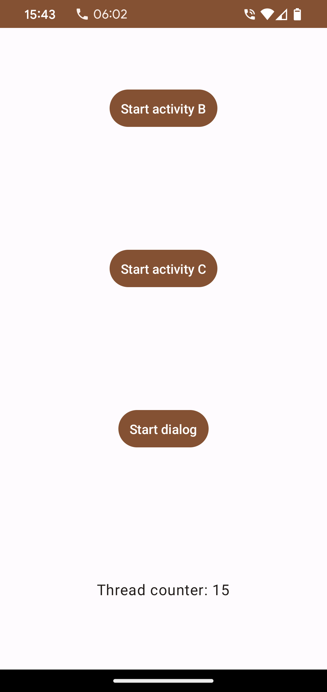
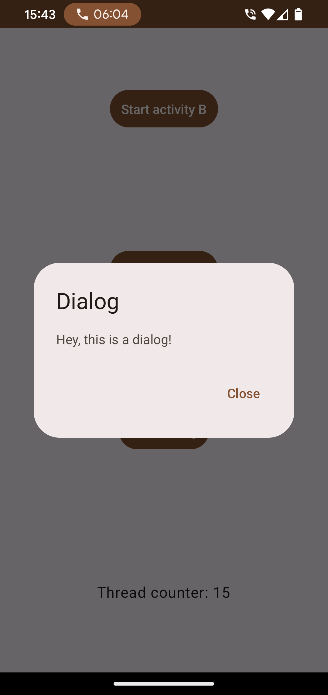

# CMPE 277 | Assignment - 1

## Student Info

| Type | Detail |
| --- | --- |
| **Name** | Rahul Sunil Pillai |
| **ID** | 016068793 |

## Description

The purpose of the app is to understand the activity life cycle and the role of Android OS plays in handling life cycle events.

https://sjsu.instructure.com/courses/1571305/assignments/6776902

## Demo

https://github.com/theGeekyLad/cmpe277-assignment-1/assets/15625446/d9db1f34-9b83-4989-a092-f63df78d6355

## Screenshots

